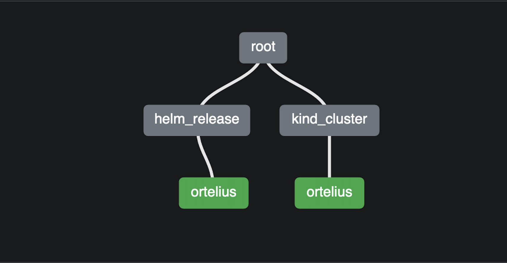
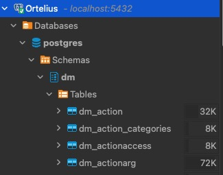
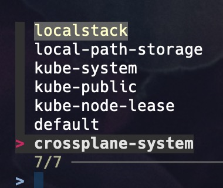
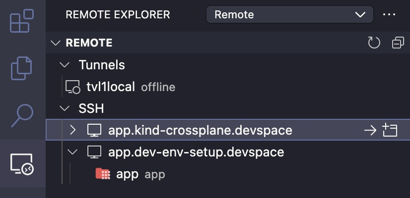
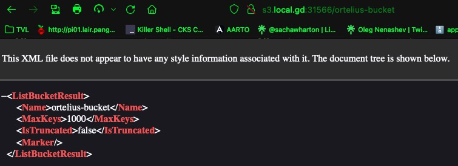

# [Ortelius](https://ortelius.io/) Local Deployment
- [Ortelius Local Deployment](#ortelius-local-deployment)
  - [Project Description](#project-description)
  - [Future Endeavours](#future-endeavours)
  - [Pre-requisite checklist](#pre-requisite-checklist)
  - [Pre Flight Checks \& Troubleshooting Tips](#pre-flight-checks--troubleshooting-tips)
  - [Ortelius](#ortelius)
      - [Terraform Structure](#terraform-structure)
  - [Ortelius](#ortelius-1)
    - [How to access Ortelius](#how-to-access-ortelius)
    - [How to access PostgreSQL with DBeaver](#how-to-access-postgresql-with-dbeaver)
      - [Connection settings](#connection-settings)
    - [Kind Ortelius Cluster Details](#kind-ortelius-cluster-details)
      - [Context `kind-ortelius`](#context-kind-ortelius)
      - [Namespaces `ortelius`](#namespaces-ortelius)
      - [Nodes](#nodes)
  - [Docker.com](#dockercom)
    - [GitHub Docker](#github-docker)
  - [Terraform | Provisioning \& Managing IaC](#terraform--provisioning--managing-iac)
    - [GitHub Terraform](#github-terraform)
      - [Terraform README](#terraform-readme)
      - [Lets get going](#lets-get-going)
      - [Time the deployment](#time-the-deployment)
      - [Don't time the deployment](#dont-time-the-deployment)
      - [Destroy the deployment](#destroy-the-deployment)
      - [Logs](#logs)
  - [KinD | Kubernetes in Docker](#kind--kubernetes-in-docker)
    - [GitHub KinD](#github-kind)
    - [Why KinD?](#why-kind)
      - [Get Nodes](#get-nodes)
      - [Kubeconfig](#kubeconfig)
      - [Get Clusters](#get-clusters)
      - [Logs | Great for debugging \& troubleshooting](#logs--great-for-debugging--troubleshooting)
  - [Container Runtime Interface (CRI) CLI | Container Troubleshooting Tool](#container-runtime-interface-cri-cli--container-troubleshooting-tool)
    - [GitHub Crictl](#github-crictl)
      - [List containers and check the container is in a created state](#list-containers-and-check-the-container-is-in-a-created-state)
      - [Start container](#start-container)
      - [Exec a command in a container](#exec-a-command-in-a-container)
  - [Kubernetes.io](#kubernetesio)
    - [GitHub Kubernetes](#github-kubernetes)
      - [Kubectl](#kubectl)
      - [Combine Kubens \& Kubectx with Fuzzy Finder | K8s Context \& Namespace Switching](#combine-kubens--kubectx-with-fuzzy-finder--k8s-context--namespace-switching)
      - [FzF](#fzf)
      - [FzF in action](#fzf-in-action)
      - [Kubectx for switching context](#kubectx-for-switching-context)
      - [Kubens for switching namespaces](#kubens-for-switching-namespaces)
  - [KubeShark Realtime visibility into K8's](#kubeshark-realtime-visibility-into-k8s)
    - [GitHub](#github)
  - [DevSpace | Dev Container inside K8s](#devspace--dev-container-inside-k8s)
    - [GitHub DevSpace](#github-devspace)
      - [How](#how)
    - [Connect VS Code](#connect-vs-code)
      - [VS Code Extensions](#vs-code-extensions)
    - [Component Helm Chart](#component-helm-chart)
      - [Why?](#why)
  - [GitHub Codespaces \& Dev Containers | Devcontainers for your GitHub repos](#github-codespaces--dev-containers--devcontainers-for-your-github-repos)
  - [Leapp | Cross-Platform Cloud access App](#leapp--cross-platform-cloud-access-app)
    - [GitHub](#github-1)
  - [Localstack | AWS Cloudstack on your local machine with Docker extensions](#localstack--aws-cloudstack-on-your-local-machine-with-docker-extensions)
    - [GitHub LocalStack](#github-localstack)
      - [LocalStack VS Code Extension](#localstack-vs-code-extension)
      - [LocalStack S3 Endpoint](#localstack-s3-endpoint)
      - [AWS CLI Local](#aws-cli-local)
  - [Thunderclient | API testing inside VS Code](#thunderclient--api-testing-inside-vs-code)
    - [GitHub](#github-2)

## Project Description

The goal is to open up the Microservices world and give visiblity to developers so that it does not feel like you are developing with a blind fold on.

Ortelius and its supporting Microservices are deployed into a Kind cluster using Terraform.

DBeaver or any suitable database client for Postgresql can be used to access the Postgresql database. The Postgres database is persisted using volume mounts.

Devspace is the tool for deploying and connecting VS Code to the Dev Container inside the Ortelius namespace. The Dev Container will contain all the tools required for development of that technology stack.

Kubeshark can be used by the developer for Microservice API troubleshooting.

The LocalStack extension in your Docker Desktop opens up the cloud world for you to develop against AWS services running locally on your machine.

Leapp is the one ring to rule them all when it comes to cloud provider authentication and role switching.

Thunderclient is a powerful API tester inside VS Code.

The great thing is that this is immutable and transportable to any operating system that supports Docker, Kubectl, Helm, Kind and Terraform.

Whilst I have tried to cover every scenario in the documentation I welcome feedback for any ambigous or missing instructions.

## Future Endeavours
- I want to do a test migration of the Ortelius eco-system to AWS using LocalStack.
- I want to improve the Devcontainer experience.

## Pre-requisite checklist
- [Docker](https://docs.docker.com/engine/install/ubuntu/)
- [Terraform](https://www.terraform.io/intro)
- [Kind](https://kind.sigs.k8s.io/)
- [Helm](https://helm.sh/)
- [Kubectl](https://kubernetes.io/docs/tasks/tools/)
- [Ortelius](https://ortelius.io)
-------------------------------------------------------------
- [VS Code](https://code.visualstudio.com/)
- [DBeaver](https://dbeaver.io/)
- [DevSpace](https://www.devspace.sh/)
- [Kubeshark](https://kubeshark.co/)
- [Leapp](https://www.leapp.cloud/)
- [Localstack](https://localstack.cloud/)
- [Thunderclient](https://www.thunderclient.com/)
- [Devdocs](https://devdocs.io/)

## Pre Flight Checks & Troubleshooting Tips
- If you have Helm Charts installed run `helm repo update`
- Kube config is expected to be in the default location `$KUBECONFIG`
- If you get an `AJAX` error when trying to login then logout first with `http://localhost:8080/dmadminweb/Logout` or you could use incognito mode (Its a cookie issue)
- If you get incorrect username or password the database is probably borked, destroy and re-deploy
- If everything goes completely haywire manually remove everything such as `*.tfstate` and the Ortelius Docker containers representing the Kind K8s nodes and execute `terraform plan -auto-approve` and `terraform apply -auto-approve`
- Please make sure you have a folder in your root `/tmp/postgres` and please make sure you add this mount point to your Docker Desktop under `Settings --> Resources --> File Sharing` `(/tmp is sufficient)`
- If you are already using ports 8080 or 5432 in your environment you will need to change the ports in `main.tf` here
```
      # ortelius http port | change port 8080 to something else if it clashes with your environment
      extra_port_mappings {
        container_port = 31000
        host_port      = 8080 <-- make the port change here
        listen_address = "0.0.0.0"
      }
      # postgresql port | change port 5432 to something else if it clashes with your environment
      extra_port_mappings {
        container_port = 31316
        host_port      = 5432 <-- make the port change here
        listen_address = "0.0.0.0"
      }
    }

```


## [Ortelius](https://ortelius.io/)

Ortelius is central catalog of supply chain and DevOps intelligence. It is designed to track and version composition details for every component of your software supply chain along with all consuming logical applications. With Ortelius, you can easily view your logical application's SBOMs, CVEs, service dependencies, and inventory based on versions, even in a decoupled microservices architecture.

Ortelius aggregates DevOps, security and supply chain data for each independent component moving through the pipeline. It is particularly useful in cloud-native, microservices architectures where the logical application becomes ambiguous. Ortelius tracks who is consuming shared components, versions them when they are updated and then creates new release candidates for every logical applicatio that is impacted by a component change. It then aggregates that data to the logical application level so you don't have to.

The latest version of Ortelius is maintained by the Ortelius Community managed by the [Continuous Delivery Foundation](https://cd.foundation/) (Linux Foundation). It was originally created by [DeployHub](https://www.deployhub.com/) and [OpenMake Software](https://www.openmakesoftware.com/). Our mission is to simplify the adoption of modern architecture through a world-class microservice catalog driven by a supportive and diverse global open source community.

#### Terraform Structure


## [Ortelius](https://ortelius.io/)
- Helm Charts are [here](https://github.com/ortelius/ortelius-charts)
- Chart.yaml is [here](https://github.com/ortelius/ortelius-charts/blob/master/Chart.yaml)
### How to access Ortelius
- Use can access Ortelius at http://localhost:8080/dmadminweb/Home#dhmain
- To log out http://localhost:8080/dmadminweb/Logout

### How to access PostgreSQL with [DBeaver](https://dbeaver.io/)
- Free multi-platform database tool for developers, database administrators, analysts and all people who need to work with databases.
- Supports all popular databases: `MySQL, PostgreSQL, SQLite, Oracle, DB2, SQL Server, Sybase, MS Access, Teradata, Firebird, Apache Hive, Phoenix, Presto, etc`.
- You can use DBeaver Community Edition which is available [here](https://dbeaver.io/)
- Supports ChatGPT integration for smart completion and code generation as an optional extension
- [Apache License 2.0](https://dbeaver.io/product/dbeaver_license.txt)

#### Connection settings
- Password
```
postgres
```

- Ortelius Database Tables



### Kind Ortelius Cluster Details
#### Context `kind-ortelius`
- List all the contexts
```
kubectl config get context
```
- Switch to the kind-ortelius context
```
kubectl config use-context kind-ortelius
```
- Help with contexts
```
kubectl config -h
```
#### Namespaces `ortelius`
- List all namespaces
```
kubectl get namespace -A
```
#### Nodes
- Control Plane `ortelius-control-plane`
- Worker `ortelius-worker`
```
kubectl get nodes -A
```

## [Docker.com](https://www.docker.com/)
### [GitHub Docker](https://github.com/docker)

Docker is a platform for developing, shipping, and running applications. It uses containers, which are lightweight, standalone, executable packages of software that include everything needed to run the application, including the code, runtime, libraries, environment variables, and system tools. Containers provide a consistent, isolated environment for applications to run, making it easier to develop, test, and deploy applications. Docker allows developers to automate the deployment of applications into containers and manage containers as a single unit. It simplifies the process of deploying applications, making it easier to scale applications, and enabling organizations to adopt a microservices architecture.

- [Account setup](https://hub.docker.com/signup)
- [Install](https://docs.docker.com/get-docker/)
- Get familiar with the basic commands
- Use [Devdocs](https://devdocs.io/) and the Docker documentation [here](https://docs.docker.com/)
- [Terms & Conditions](https://www.docker.com/legal/docker-terms-service/)

## [Terraform](https://www.terraform.io/intro) | Provisioning & Managing IaC
### [GitHub Terraform](https://github.com/hashicorp/terraform)

Terraform is an open-source tool for provisioning and managing infrastructure as code. It provides a simple, declarative syntax for defining infrastructure resources, such as virtual machines, DNS entries, and databases. Terraform can manage popular service providers as well as custom in-house solutions. By describing infrastructure as code, Terraform enables versioning, testing, and collaboration of infrastructure changes. Terraform can create, update, and delete resources in parallel, while minimizing the risk of conflicts and errors. Terraform also provides a state management system that tracks changes to infrastructure over time, making it easier to roll back changes if necessary. With Terraform, organizations can automate their infrastructure management processes, improve reliability, and increase efficiency.

#### [Terraform README](TF-README.md)
- Install Terraform [here](https://www.terraform.io/downloads)
- Documentation is [here](https://www.terraform.io/docs)
- [Terms & Conditions](https://registry.terraform.io/terms)
- [Licence](https://github.com/hashicorp/terraform/blob/main/LICENSE)

#### Lets get going
- Clone the repo
- Navigate to `/`
- Run the following
```
terraform init
```
```
terraform plan
```

<a href="https://asciinema.org/a/6VyaISagE33JoHMif8HmWiQ10" target="_blank"></a>

#### Time the deployment
```
time terraform apply --auto-approve
```
#### Don't time the deployment
```
terraform apply --auto-approve
```

<a href="https://asciinema.org/a/562847" target="_blank"></a>

#### Destroy the deployment
```
terraform destroy --auto-approve
```

<a href="https://asciinema.org/a/562837" target="_blank"></a>

#### Logs

In total, there 5 log levels which can be used for debugging purposes:

- `TRACE` one of the most descriptive log levels, if you set the log level to *TRACE,* Terraform will write every action and step into the log file.
- `DEBUG` a little bit more sophisticated logging which is used by developers at critical or more complex pieces of code to reduce debugging time.
- `INFO` the info log level is useful when needing to log some informative instructions or readme type instructions.
- `WARN` used when something is not critical but would be nice to include in the form of a log so that the developer can make adjustments later.
- `ERROR` as the name suggests, this is used if something is terribly wrong and is a blocker.
```
export TF_LOG="DEBUG"
```
```
export TF_LOG_PATH="/abraham/terraform-debug.log"
```

## [KinD](https://kind.sigs.k8s.io/) | Kubernetes in Docker
### [GitHub KinD](https://github.com/kubernetes-sigs/kind)

Kind (Kubernetes in Docker) is a tool for running local Kubernetes clusters using Docker containers as nodes. It provides an easy-to-use environment for testing and developing applications that run on a Kubernetes cluster. Kind allows developers to run a full Kubernetes cluster on their development machine, eliminating the need for remote clusters and making it easier to test and debug applications. Kind creates a multi-node cluster by launching multiple Docker containers on a single host, making it possible to test complex scenarios and network configurations. Kind is also useful for testing Kubernetes plugins and extensions, and for developing and testing operators, custom controllers, and other Kubernetes-related software.

- Install [here](https://kind.sigs.k8s.io/docs/user/quick-start/#installation)
- Documentation is [here](https://kind.sigs.k8s.io/docs/user/quick-start/)
- [Terms & Conditions](https://www.apache.org/licenses/LICENSE-2.0)
- [Licence](https://github.com/kubernetes-sigs/kind/blob/main/LICENSE)

### Why KinD?
- kind supports multi-node (including HA) clusters
- kind supports building Kubernetes release builds from source
- support for make / bash or docker, in addition to pre-published builds
- kind supports Linux, macOS and Windows
- kind is a `CNCF certified conformant Kubernetes installer`


#### Get Nodes
```
kind get nodes ortelius
```
#### Kubeconfig
```
kind get kubeconfig -n ortelius
```
#### Get Clusters
```
kind get clusters
```
#### Logs | Great for debugging & troubleshooting
```
kind export logs -n ortelius
```

## [Container Runtime Interface (CRI) CLI](https://kubernetes.io/docs/tasks/debug/debug-cluster/crictl/) | Container Troubleshooting Tool
### [GitHub Crictl](https://github.com/kubernetes-sigs/cri-tools/blob/master/docs/crictl.md)

Crictl is a command line tool for interacting with a containerd-based container runtime. It provides a simple, human-readable interface for performing common container operations such as pulling images, starting and stopping containers, and viewing logs. Crictl also supports advanced features such as executing commands inside containers and managing network configurations. It is designed to be a fast and flexible alternative to other container runtime management tools, and can be used in production or development environments. Crictl is a component of the containerd project, which is a lightweight, high-performance runtime for managing containers and is used by many popular container orchestration platforms such as Kubernetes.

- Download crictl [here](https://github.com/kubernetes-sigs/cri-tools/blob/master/docs/crictl.md)

#### List containers and check the container is in a created state
```
$ crictl ps -a
CONTAINER ID        IMAGE               CREATED             STATE               NAME                ATTEMPT
3e025dd50a72d       busybox             32 seconds ago      Created             busybox             0
```
#### Start container
```
$ crictl start 3e025dd50a72d956c4f14881fbb5b1080c9275674e95fb67f965f6478a957d60
3e025dd50a72d956c4f14881fbb5b1080c9275674e95fb67f965f6478a957d60

$ crictl ps
CONTAINER ID        IMAGE               CREATED              STATE               NAME                ATTEMPT
3e025dd50a72d       busybox             About a minute ago   Running             busybox             0
```
#### Exec a command in a container
```
crictl exec -i -t 3e025dd50a72d956c4f14881fbb5b1080c9275674e95fb67f965f6478a957d60 ls
bin   dev   etc   home  proc  root  sys   tmp   usr   var
```

## [Kubernetes.io](https://kubernetes.io/)

Kubernetes is an open-source platform for automating deployment, scaling, and management of containerized applications. It provides a unified API for defining and managing containers, enabling organizations to simplify the deployment and scaling of applications. Kubernetes automates the distribution of containers across a cluster of machines and monitors the health of the containers, ensuring that they are always running. It can automatically replace failed containers and ensure that the desired number of replicas are running. Kubernetes also provides built-in service discovery and load balancing, making it easier to connect microservices and ensure that traffic is distributed evenly across the cluster. Kubernetes has become the de facto standard for container orchestration and is widely adopted by organizations of all sizes.

### [GitHub Kubernetes](https://github.com/kubernetes-sigs)
- [Terms & Conditions](https://www.linuxfoundation.org/legal/terms#:~:text=Users%20are%20solely%20responsible%20for,arising%20out%20of%20User%20Content.)
- [Creative Commons](https://creativecommons.org/licenses/by/3.0/)
#### Kubectl
- Install `kubectl` the command line tool [here](https://kubernetes.io/docs/tasks/tools/)
- Use the `kubectl` cheat sheet [here](https://kubernetes.io/docs/reference/kubectl/cheatsheet/)
- Use [Devdocs](https://devdocs.io/) and the official documentation [here](https://kubernetes.io/docs/home/)
- Add the `aliases` & `auto complete` which are in the `cheat sheet`

- Real time logging of a pod
```
kubectl logs ms-nginx-6ccbb5f95c-9gjg7 -n ortelius -f
```
- Remote into a pod
```
kubectl -n ortelius exec -it ms-nginx-6ccbb5f95c-9gjg7 -n ortelius -c ms-nginx -- sh
```

#### Combine Kubens & Kubectx with Fuzzy Finder | K8s Context & Namespace Switching
- `kubectx` is a tool to switch between contexts (clusters) on kubectl faster.
- `kubens` is a tool to switch between Kubernetes namespaces (and configure them for kubectl) easily.
- Download `Kubens & Kubectx` [here](https://github.com/ahmetb/kubectx)
- [Licence](https://github.com/ahmetb/kubectx/blob/master/LICENSE)

#### FzF
- Is a general-purpose command-line fuzzy finder.
- Is an interactive Unix filter for command-line that can be used with any list; files, command history, processes, hostnames, bookmarks, git commits, etc.
- Download `Fuzzy Finder` [here](https://github.com/junegunn/fzf)
- [Licence](https://github.com/junegunn/fzf/blob/master/LICENSE)

#### FzF in action



#### Kubectx for switching context
```
kubectx kind-ortelius
```
#### Kubens for switching namespaces
```
kubens ortelius
```

## [KubeShark](https://kubeshark.co/) Realtime visibility into K8's
### [GitHub](https://github.com/kubeshark/kubeshark)

Real-time visibility into K8s' internal network, capturing, dissecting and monitoring all traffic and payloads going in, out and across containers, pods, nodes and clusters.

- Install [here](https://kubeshark.co/)
- Documentation is [here](https://docs.kubeshark.co/en/introduction)
- [Licence](https://github.com/kubeshark/kubeshark/blob/master/LICENSE)
- Tap Ortelius `kubeshark tap -n ortelius`

## [DevSpace](https://devspace.sh/) | Dev Container inside K8s
### [GitHub DevSpace](https://github.com/devspace-sh/devspace)
- What is [DevSpace](https://www.devspace.sh/docs/getting-started/introduction)
- Devspace could be used for the local Terraform environment whereas Codespaces is more suited for a developer on the repos themselves
- [Licence](https://github.com/devspace-sh/devspace/blob/main/LICENSE)

#### How
- Download the CLI [here](https://devspace.sh/cli/docs/getting-started/installation)
- Init DevSpace in your repo and use the existing `Dockerfile` and `devspace.yaml`  by following the prompts.
- Currently it is using the Microsoft Universal [Dev Container](https://github.com/devcontainers/images/tree/main/src/universal) which I have built and pushed to my DockerHub
- The Microsoft Universersal Dev Container has the following language platforms `Python, Node.js, JavaScript, TypeScript, C++, Java, C#, F#, .NET Core, PHP, Go, Ruby, Conda`
- [Licence](https://github.com/devcontainers/images/blob/main/LICENSE)
```
devspace init
```
- run the UI
```
devspace ui
```
- start coding
```
devspace dev -n ortelius

warn Are you using the correct namespace?
warn Current namespace: 'default'
warn Last    namespace: 'devspace'

? Which namespace do you want to use? devspace
info Using namespace 'devspace'
info Using kube context 'kind-ortelius'
info Created namespace: devspace
deploy:app Deploying chart component-chart (app) with helm...
deploy:app Deployed helm chart (Release revision: 1)
deploy:app Successfully deployed app with helm
dev:app Waiting for pod to become ready...
dev:app DevSpace is waiting, because Pod app-devspace-6dcdc9bf56-trrrc has status: ContainerCreating
dev:app DevSpace is waiting, because Pod app-devspace-6dcdc9bf56-trrrc has status: ContainerCreating
dev:app DevSpace is waiting, because Pod app-devspace-6dcdc9bf56-trrrc has status: ContainerCreating
dev:app DevSpace is waiting, because Pod app-devspace-6dcdc9bf56-trrrc has status: ContainerCreating
dev:app DevSpace is waiting, because Pod app-devspace-6dcdc9bf56-trrrc has status: ContainerCreating
dev:app DevSpace is waiting, because Pod app-devspace-6dcdc9bf56-trrrc has status: ContainerCreating
dev:app DevSpace is waiting, because Pod app-devspace-6dcdc9bf56-trrrc has status: ContainerCreating
dev:app DevSpace is waiting, because Pod app-devspace-6dcdc9bf56-trrrc has status: ContainerCreating
dev:app DevSpace is waiting, because Pod app-devspace-6dcdc9bf56-trrrc has status: ContainerCreating
dev:app Selected pod app-devspace-6dcdc9bf56-trrrc
dev:app ports Port forwarding started on: 2345 -> 2345
dev:app sync  Sync started on: ./ <-> /app
dev:app sync  Waiting for initial sync to complete
dev:app sync  Initial sync completed
dev:app ssh   Port forwarding started on: 10479 -> 8022
dev:app proxy Port forwarding started on: 11920 <- 10567
dev:app ssh   Use 'ssh app.dev-env-setup.devspace' to connect via SSH
dev:app term  Opening shell to container-0:app-devspace-6dcdc9bf56-trrrc (pod:container)
```
- On the command line switch to the `bash shell`
```
devspace ./app # bash
```
```
root@app-devspace-6dcdc9bf56-6snnf:/# cd app
```
```
root@app-devspace-6dcdc9bf56-6snnf:/app# ls
Dockerfile  README.md     app            devspace_start.sh  localstack.yaml  module.tf  outputs.tf  plan.out      service-nginx.yaml  variables.tf
LICENSE     TF-README.md  devspace.yaml  images             main.tf          ortelius   plan.json   providers.tf  terraform.tfstate   wazuh
```

### Connect VS Code
#### VS Code Extensions
- Install the `Remote-SSH` extension [here](https://marketplace.visualstudio.com/items?itemName=ms-vscode-remote.remote-ssh)
- Click on the `Remote Explorer` icon



- SSH Settings configured by Devspace
```
# DevSpace Start app.dev-env-setup.devspace
Host app.dev-env-setup.devspace
  HostName localhost
  LogLevel error
  Port 10479
  IdentityFile "/Users/tvl/.devspace/ssh/id_devspace_ecdsa"
  StrictHostKeyChecking no
  UserKnownHostsFile /dev/null
  User devspace
# DevSpace End app.dev-env-setup.devspace
```
- Install PostgreSQL Database Manager for database admin from inside your vscode [here](https://marketplace.visualstudio.com/items?itemName=cweijan.vscode-postgresql-client2)
- The extension supports many database engines so don't be misled by the name


### [Component Helm Chart](https://www.devspace.sh/component-chart/docs/introduction)

The component chart allows you to define application components (e.g. a database, an API server, a webserver with static files) and deploy them using Helm. Helm is the package manager for Kubernetes and allows you to manage these components (e.g. upgrading).

#### Why?

Compared to manually creating Helm charts, the component chart allows you to define your application components using a unified Helm chart.

This provides the following benefits:
- 70% less YAML to maintain (only values.yaml for chart)
- Highly flexible configuration via values.yaml
- Fast and easy definition of Kubernetes resources
- Kubernetes best practices (e.g. recommended annotations and labels)

## [GitHub Codespaces](https://docs.github.com/en/codespaces/overview) & [Dev Containers](https://containers.dev/) | Devcontainers for your GitHub repos
- [Developing inside a container](https://code.visualstudio.com/docs/devcontainers/containers)
- [Introduction to Dev Containers](https://docs.github.com/en/codespaces/setting-up-your-project-for-codespaces/adding-a-dev-container-configuration/introduction-to-dev-containers)
- [Beginners Series to Dev Containers](https://learn.microsoft.com/en-us/shows/beginners-series-to-dev-containers/)
- [Getting Started with Dev Containers](https://microsoft.github.io/code-with-engineering-playbook/developer-experience/devcontainers/)
- [VS Code Dev Containers Extension](https://marketplace.visualstudio.com/items?itemName=ms-vscode-remote.remote-containers&WT.mc_id=devcloud-11496-buhollan)

## [Leapp](https://www.leapp.cloud/) | Cross-Platform Cloud access App
### [GitHub](https://github.com/Noovolari/leapp)

Leapp is a Cross-Platform Cloud access App, built on top of Electron.
The App is designed to manage and secure Cloud Access in multi-account environments, and it is available for MacOS, Windows, and Linux.
- Cloud credentials generation in 1 click
- Data stored locally encrypted in the OS System Vault
- Multiple Cloud-Access supported strategies
- Automatic short-lived credentials rotation
- Automatic provisioning of Sessions from AWS Single Sign-on
- Open multiple AWS console from different AWS accounts in Firefox and Chrome web extensions!
- Connect to EC2 instances straight away
- Managing Leapp with its CLI
- Create your own Leapp plugin to customize the App functionalities from the template
- Download [here](https://docs.leapp.cloud/latest/installation/install-leapp/)
- [Licence](https://github.com/Noovolari/leapp/blob/master/LICENSE)

## [Localstack](https://docs.localstack.cloud/overview/) | AWS Cloudstack on your local machine with Docker extensions
### [GitHub LocalStack](https://github.com/localstack)

LocalStack is a fully functional local AWS cloud stack that enables developers to develop and test their cloud applications offline. It provides an easy-to-use test/mocking framework for developing cloud applications, eliminating the need for a live AWS environment.

- LocalStack is installed using the Docker Desktop extension, please refer [here](https://docs.localstack.cloud/user-guide/tools/localstack-docker-extension/)
- [LocalStack Configurations](https://docs.localstack.cloud/references/configuration/)
- [LocalStack Quickstart](https://docs.localstack.cloud/getting-started/quickstart/)
- [LocalStack CLI](https://docs.localstack.cloud/references/localstack-cli-manual/)
- [LocalStack AWS Local CLI](https://docs.localstack.cloud/user-guide/integrations/aws-cli/)
- [LocalStack Terraform](https://docs.localstack.cloud/user-guide/integrations/terraform/)
- [LocalStack CI](https://docs.localstack.cloud/user-guide/ci/)
- [LocalStack Testing Tools](https://docs.localstack.cloud/user-guide/tools/testing-tools/)
- [Localstack Serverless Plugin](https://github.com/localstack/serverless-localstack)
- All endpoints are referenced as `http://localhost:4566`
- Not all endpoints are supported in the free version, please refer [here](https://docs.localstack.cloud/user-guide/aws/feature-coverage/) for supported features
- [Licence](https://github.com/localstack/localstack/blob/master/LICENSE.txt)

#### LocalStack VS Code Extension
- `Commandeer` extension [here](https://marketplace.visualstudio.com/items?itemName=Commandeer.commandeer)


#### LocalStack S3 Endpoint


#### [AWS CLI Local](https://github.com/localstack/awscli-local)
- This package provides the `awslocal` command, which is a thin wrapper around the aws command line interface for use with LocalStack.
```
awslocal --endpoint-url=http://localhost:4566 kinesis list-streams
StreamNames: []
```

## [Thunderclient](https://www.thunderclient.com/) | API testing inside VS Code
### [GitHub](https://github.com/rangav/thunder-client-support)

A new way to test APIs inside VS Code

- Simple & Easy to Use CLI tool
- Seamless Integration with Thunder Client Extension
- Run Requests/Collections and View Test results
- Syntax Highlighting and VSCode Themes
- Open Request/Collection UI from the terminal
- Enhances CURL commands
- CI/CD Integration
- Please refer [here](https://rangav.medium.com/thunder-client-cli-a-new-way-to-test-apis-inside-vscode-d91eb5c71d8e)for more detail
- [Licence](https://github.com/rangav/thunder-client-support/blob/master/LICENSE.txt)